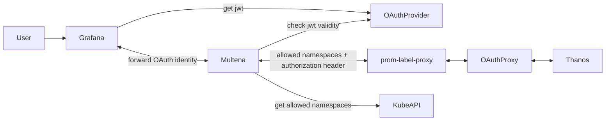

# Multena Proxy
making the LGTM(P)-Stack MULti TENAncy ready

## What is Multena?
It is a reverse proxy that can be used to differentiate between multiple tenants.

## Currently supporting
- [x] Metrics
- [ ] Logging
- [ ] Tracing
- [ ] Profiling

## Metrics request flow
For Openshift 4.11 ^
may vary for other versions



## How to use
### Deploying Multena
The deployment part of Multena is written in jsonnet and can be deployed using the tanka / ArgoCD.
```bash 
./jsonnet
jb install
tk apply environments/default/main.jsonnet
```

Env variablen
* DEV=false; uses for switching between kubeconfig and in cluster config 
* UPSTREAM_URL; the url of the upstream service
* UPSTREAM_BYPASS_URL; the url of the upstream service bypassing the prom-label-proxy, used for token exchange
* CLIENT_SECRET; keycloak client secret
* TOKEN_EXCHANGE=false; enables token exchange against a keycloak
* KEYCLOAK_CERT_URL; url to the keycloak certificate
* ADMIN_GROUP; name of the group that is allowed for a token exchange