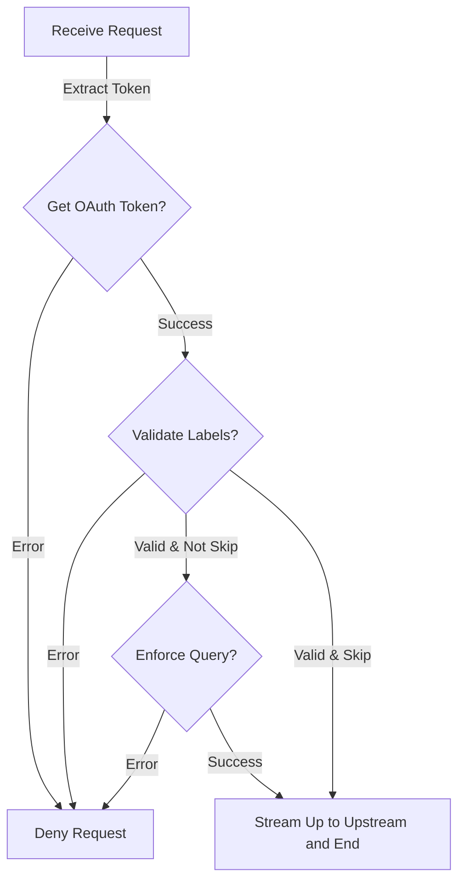
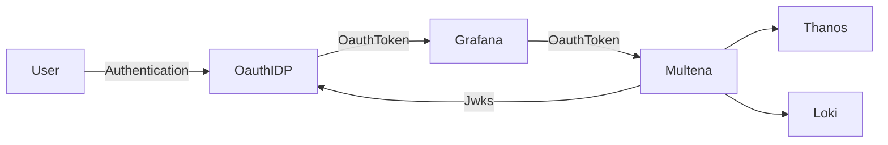

# Multena Proxy

Making the LGTM-Stack **mul**ti **tena**ncy ready

[](https://goreportcard.com/report/github.com/gepaplexx/multena-proxy)
[](https://github.com/gepaplexx/multena-proxy/actions/workflows/release.yml)
[](https://godoc.org/github.com/gepaplexx/multena-proxy)
[](https://github.com/gepaplexx/multena-proxy/releases/latest)


---
**Multena Proxy** is a multi-tenancy ready tool designed to enhance the authorization capabilities of your LGTM (Loki
Grafana Tempo Mimir(Prometheus Style API / OpenMetrics)) stack. Built with LBAC (Label Based Access Control) at its
core.

Multena provides secure and granular user authorization based on assigned tenant labels.
It integrates seamlessly with PrometheusAPI and Loki, and
should support generic oauth provider for identity management. With features like ConfigMap-based configuration,
flexible authorization providers, and multiple tenant labels, Multena ensures that the right data is accessible to the
right users.

---
> __NOTE:__ Multena was initially developed to support OpenShift 4's internal Prometheus, which is powered by Thanos.
> As a result, many references in Multena are made to Thanos, which serves as an API following the Prometheus style.

## How does it work?



In summary, here's how Multena works:

1. Multena receives a request.
2. Multena performs an authorization check in the form of a JWT token validation.
3. If the user is not authorized, Multena denies the query without further processing.
4. If the user is authorized, Multena examines which labels corrispond to the user.
5. If the user has no labels, Multena denies the query without further processing.
6. if the user has labels and its skip (e.g., cluster wide access), it will forward the request to the upstream server
   without further processing.
7. If the user has labels, and it's not a skip, Multena checks if the values in the label match in the query are allowed
   for the user.
8. If the values are not allowed, Multena dienies the request without further processing.
9. If there are no label matches for the tenant label (e.g., namespace), Multena will append the allowed labels to the
   query.
10. If the values are allowed, Multena forwards the query to the specific endpoint or service responsible for processing
    the query.
11. Multena streams the response from the upstream server to the client.

By performing authorization checks, label matching, appending labels, Multena ensures that
users can only query data they are authorized to access.

## Multena Features

| **Feature**                             | **Description**                                                                                                                                                                                            |
|-----------------------------------------|------------------------------------------------------------------------------------------------------------------------------------------------------------------------------------------------------------|
| Authorization Based on Labels           | Enables access control and permissions based on specified labels, ensuring fine-grained access control tailored to your needs.                                                                             |
| Configurable via ConfigMap              | Allows easy configuration of the proxy using a ConfigMap, simplifying setup process and management of configuration settings.                                                                              |
| Flexible Authorization Providers        | Supports both ConfigMap and database label store providers. Choose the provider that best fits your requirements.                                                                                          |
| Integration with PrometheusAPI and Loki | Seamlessly integrates with PrometheusAPI and Loki for efficient authorization. Manage and control access to these powerful observability tools.                                                            |
| Authentication via OAuth                | Authenticate users using a OAuth provider with JWKS (JSON Web Key Set) to ensure secure and reliable authorization.                                                                                        |
| Admin Group Privileges                  | Includes an admin group feature allowing users in the specified admin group to bypass enforcing steps. This is useful for granting administrative privileges to specific users.                            |
| Multiple Tenant Label values            | Supports multiple tenant label values for managing different sets of label values for different tenants. Customize and control access for various groups and users based on their respective tenant label. |
| Strict communication                    | Multena can send either a bearer token in requests to communicate with components protected by OAuth2 proxy or use mutualTLS to ensure a strict and secure communication.                                  |

## Currently queryable

- [x] Metrics
- [x] Logging
- [ ] Traces
- [ ] Profiles

## Request flow

### integrated flow



Jwks is the JSON Web Key Set, which is used to validate the JWT token. It's like a public key for the JWT token.

## Deploy Multena

The helm chart for Multena is available
at [gp-helm-charts](https://github.com/gepaplexx/gp-helm-chart-development/tree/develop/infra/gp-multena)

To install run the following commands:

```bash 
helm repo add gepardec https://gepaplexx.github.io/gp-helm-charts/
helm install multena gepardec/gp-multena -n <grafana-namespace>
```

To upgrade, run the following commands:

```bash
helm repo update
helm upgrade multena gepardec/gp-multena -n <grafana-namespace>
```

> **_NOTE:_** If your using the grafana operator, the helm chart provides an option to install
> grafana-operator-datasources
> which simplifies the deployment of Multena. If you deploy Multena without the grafana-operator-datasources you have to
> configure the datasource manually.

# Configuring Multena

## Labelstore Providers

> **_NOTE:_** Currently Multena offers two different providers for label lookup, namely ConfigMap and MySQL.

### ConfigMap

With the ConfigMap provider, Multena can retrieve labels by reading a separate ConfigMap that defines a list of
allowed labels for each user or group. This approach allows for easy configuration and management of label permissions
by specifying the allowed labels directly in the ConfigMap. An example can be found
here [labels.yaml](./configs/labels.yaml)

You can define the allowed labels for groups and users manually, but if you deploy multena in a single cluster, we
recommend
to use the [multena-rbac-collector](https://github.com/gepaplexx/multena-rbac-collector) to continuesly collect the
permissions
for each user and group. This tool will create a labels.yaml file which can be directly used by Multena.
To enable it set, the following setting

```yaml
rbac-collector:
  enabled: true 
```

in the helm chart.

### MySQL

The MySQL provider enables label lookup through executing a custom
query against a MySQL database. This capability allows Multena to dynamically fetch the allowed tenant lalbel (e.g.,
namespace)
for a specified email or user or groups. By setting the appropriate query in the configuration, Multena can seamlessly
retrieve
the relevant label information from the MySQL database.

This makes only sense if you already have a MySQL database with a systematic way to get the permissions for a user.

> **_NOTE:_** As every query sends a query to the database, we recommend enabling caching for the database.

### config.yaml

#### proxy section

```yaml
web:
  proxy_port: 8080 # port on which the proxy will listen
  metrics_port: 8081 # port on which the metrics will be exposed
  host: localhost # host on which the proxy will listen
  tls_verify_skip: true # skip tls verification for the upstream server, very insecure!!!
  trusted_root_ca_path: "./certs/" # path to the trusted root ca
  label_store_kind: "configmap" # kind of label store, currently only configmap and mysql are supported
  jwks_cert_url: https://sso.example.com/realms/internal/protocol/openid-connect/certs # url to the jwks certificate
  oauth_group_name: "groups" # name of the group field in the jwt token
```

#### datasource section (thanos|loki)

```yaml
thanos|loki: # choose either thanos or loki
url: https://localhost:9091 # url to the thanos or loki endpoint     | Required
tenant_label: namespace # label which is used to enforce the query   | Required
cert: "./certs/thanos/tls.crt" # path to the mtls certificate        | Optional
key: "./certs/thanos/tls.key" # path to the mtls key                 | Optional
Header: # headers which will be added to the request                 | Optional
  X-Scope-OrgID: "application"

```

#### logging section

```yaml
log:
  level: 1 # log level, 0 = debug, 1 = info, 2 = warn, 3 = error, -1 = trace exposes sensitive data!!!
  log_tokens: false # logs jwt, expose sensitive data!!!
```

#### admin section

```yaml
admin:
  bypass: true # enable bypassing the enforcing steps
  group: gepardec-run-admins # group which is allowed to bypass the enforcing steps
```

#### db section

```yaml
db:
  enabled: false # enable connection to a database
  user: multitenant # username for the database
  password_path: "." # path to the password for the database (kubernetes secret)
  host: localhost # host of the database
  port: 3306 # port of the database
  dbName: example # name of the database
  query: "SELECT * FROM users WHERE username = ?" # query to retrieve data from the database, must return a list of labels
  token_key: "email|username|groups" # field in the jwt which will be used to query the database 
```

### labels.yaml

The `labels.yaml` file is used to define the allowed labels for groups and users in Multena. It follows a specific YAML
format as shown below:

```yaml
group1:
  '#cluster-wide': true # this grants the group to skip enforcement
user1:
  hogarama: true # single namespace
user3:
  grafana: true # multi namespace
  opernshift-logging: true
  opernshift-monitoring: true
```

The format consists of a key for username|groupname, followed by another key value pair where the key 
is the label and value is true.
This has been done to look up the labels faster.

## To configure the Proxy Multena, follow these steps:

1. Create a YAML file (e.g., `config.yaml`).

2. Copy the sample configuration provided above into the file.

3. Modify the configuration options according to your requirements. Here's an overview of the options you might need to
   modify:
    1.
        - For `provider` set either configmap or mysql depending on your needs.

        - Set the appropriate values for `log_level`, `thanos_url`, `loki_url`, `jwks_cert_url`, `admin_group`,
          and `port`
          based on your environment and preferences.

        - Adjust the values of `tenant_labels.thanos` and `tenant_labels.loki` to match your desired tenant labels.

        - If you don't need the development mode, set `dev.enabled` to `false`. Otherwise, set `dev.username`
          and `dev.service_account_token` to appropriate values.

    2. Database: If you use mysql as a provider update the `db` section with the correct values
       for `user`, `password_path`, `host`, `port`, `dbName`, and `query` to connect to your database and execute the
       desired query.

    3. ConfigMap: If you have set the current provider to ConfigMap, you need to configure the labels by using a
       labels.yaml file with the following format:
       ```yaml
       groups:
          - example_group: [ "example_namespace" ]
       users:
          - example_user: [ "example_namespace" ]
       ````
       In the labels.yaml file, you define the allowed labels for groups and users. Each group or user is listed along
       with
       the corresponding list of allowed namespaces. For example, the example_group is allowed to access the
       example_namespace, and the example_user is also allowed to access the example_namespace.

4. Add Multena as Grafana data source and configure it with the correct values:
   The Datasource needs one header to be set:
    - `X-Plugin-Id: <thanos or loki>`
      to work properly it also needs the forward oauth identify option to be set.
      The loki option may need the "/api/logs/v1/application/" url suffix to work properly

By following these steps and customizing the configuration options to your needs, you can effectively configure
Multena to work with your Grafana, Thanos, Loki, and database setup.

### Service Account Token Authentication

Multena uses its service account token to authenticate with data sources. This is necessary because, in environments
like OpenShift 4, data sources are typically protected by the OAuth2 proxy. This approach should be taken in
non-OpenShift 4 environments as well.

The right role bindings for Multena need to be set. In small OpenShift deployments, the cluster-monitoring-view role
should be assigned. This role binding is set up by the helm chart during deployment. These steps ensure Multena can
correctly access the data sources.