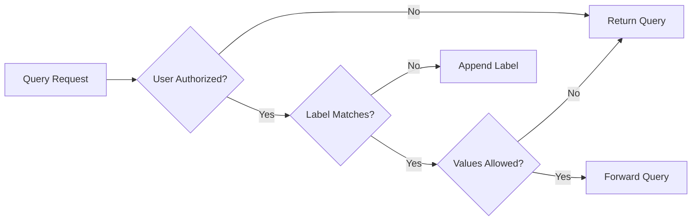
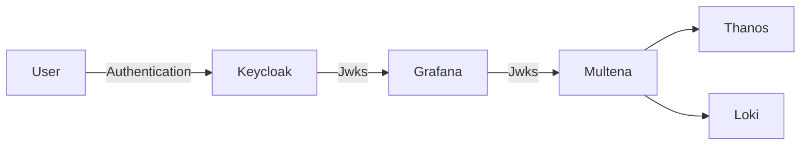
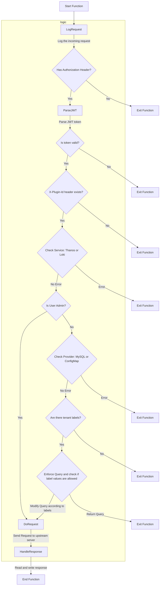

# Multena Proxy

Making the LGTM-Stack **mul**ti **tena**ncy ready

[](https://goreportcard.com/report/github.com/gepaplexx/multena-proxy)
[](https://github.com/gepaplexx/multena-proxy/actions/workflows/release.yml)
[](https://godoc.org/github.com/gepaplexx/multena-proxy)
[](https://github.com/gepaplexx/multena-proxy/releases/latest)


---
**Multena Proxy** is a multi-tenancy ready tool designed to enhance the authorization capabilities of your LGTM (Loki
Grafana Tempo Mimir(Prometheus Style API / OpenMetrics)) stack. Built with LBAC (Label Based Access Control) at its
core.

Multena provides secure and granular user authorization based on assigned tenant labels. 
It integrates seamlessly with PrometheusAPI and Loki, and
should support generic oauth provider for identity management. With features like ConfigMap-based configuration, 
flexible authorization providers, and multiple tenant labels, Multena ensures that the right data is accessible to the right users.

---
> __NOTE:__ Multena was initially developed to support OpenShift 4's internal Prometheus, which is powered by Thanos.
> As a result, many references in Multena are made to Thanos, which serves as an API following the Prometheus style.

## How does it work?



In summary, here's how Multena works:

1. Multena receives a query request.
2. Multena performs an authorization check to determine if the user is allowed to access the query.
3. If the user is not authorized, Multena returns the query without further processing.
4. If the user is authorized, Multena examines the query for label matches.
5. If there are no label matches, Multena appends the appropriate label to the query.
6. If there are label matches, Multena checks if the values in the label match are allowed for the user.
7. If the values are not allowed, Multena returns the query without further processing.
8. If the values are allowed, Multena forwards the query to the specific endpoint or service responsible for processing
   it.

By performing label matching, appending labels when necessary, and performing authorization checks, Multena ensures that
users can only query data they are authorized to access.

## Multena Features

| **Feature**                             | **Description**                                                                                                                                                                                                             |
|-----------------------------------------|-----------------------------------------------------------------------------------------------------------------------------------------------------------------------------------------------------------------------------|
| Authorization Based on Labels           | Enables access control and permissions based on specified labels, ensuring fine-grained access control tailored to your needs.                                                                                              |
| Configurable via ConfigMap              | Allows easy configuration of the proxy using a ConfigMap, simplifying setup process and management of configuration settings.                                                                                               |
| Flexible Authorization Providers        | Supports both ConfigMap and database authorization providers. Choose the provider that best fits your requirements.                                                                                                         |
| Integration with PrometheusAPI and Loki | Seamlessly integrates with PrometheusAPI and Loki for efficient authorization. Manage and control access to these powerful observability tools.                                                                             |
| Support for Keycloak and Jwks           | Provides support for Keycloak, a popular open-source identity and access management solution. Authenticate users using Keycloak and retrieve the JWKS (JSON Web Key Set) certificate for secure and reliable authorization. |
| Admin Group Privileges                  | Includes an admin group feature allowing users in the specified admin group to bypass authorization checks. This is useful for granting administrative privileges to specific users.                                        |
| Multiple Tenant Label values            | Supports multiple tenant label values for managing different sets of label values for different tenants. Customize and control access for various groups and users based on their respective tenant label.                  |
| Communication with OpenShift Components | Multena sends a bearer token in requests to communicate with OpenShift components protected by OAuth2 proxy.                                                                                                                |

## Currently queryable

- [x] Metrics
- [x] Logging
- [ ] Traces
- [ ] Profiles

## Request flow

### integrated flow



### request processing flow



## Deploy Multena

The helm chart for Multena is available
at [gp-helm-charts](https://github.com/gepaplexx/gp-helm-chart-development/tree/develop/infra/gp-multena)

To install it run the following commands:

```bash 
helm repo add gepardec https://gepaplexx.github.io/gp-helm-charts/
helm install multena gepardec/gp-multena -n <grafana-namespace>
```

To upgrade it run the following commands:

```bash
helm repo update
helm upgrade multena gepardec/gp-multena -n <grafana-namespace>
```

> **_NOTE:_** The helm chart has a option to install grafana-operator-datasources which simplifies the deployment of
> Multena. If you deploy Multena without the grafana-operator-datasources you have to configure the datasource manually.

# Configuring Multena

## Modes

> **_NOTE:_** Multena utilizes two different providers for label lookup, namely ConfigMap and MySQL.

> With the ConfigMap provider, Multena can retrieve labels by reading a separate ConfigMap that defines a list of
> allowed labels for each user or group. This approach allows for easy configuration and management of label permissions
> by specifying the allowed labels directly in the ConfigMap. An exaple can be found
> here [labels.yaml](./configs/labels.yaml)

> On the other hand, Multena also supports the MySQL provider, which enables label lookup through executing a custom
> query against a MySQL database. This capability allows Multena to dynamically fetch the allowed namespaces
> for a specified email or user. By setting the appropriate query in the configuration, Multena can seamlessly retrieve
> the relevant label information from the MySQL database.

## Configuration

### ConfigMap Mode

For smaller deployments or for the introduction of a new client into a cluster, the 'manual' mode allows users to
manually configure the 'users' and 'groups' fields. This gives fine-grained control over permissions and enables rapid
setup for simpler environments

However, for larger deployments where many users and groups with varied permissions already exist, a different approach
is more efficient. Multena offers an auxiliary tool called
the ['multena-rbac-collector'](https://github.com/gepaplexx/multena-rbac-collector). This tool, when run by an
administrator, collects the specific pod 'get' permissions for each namespace for every user and group. The result is
a 'labels.yaml' file which can be directly used by Multena. This automated collection greatly simplifies the setup for
larger environments, ensuring the user doesn't need to manually input a multitude of permissions. However, it's
important to note that this mode is suitable only when all required tenant label values are namespaces within the same
cluster.

### MySQL Mode

This mode only makes sense if you have a MySQL database with a systematic way to get the permissions for a user. The
query should return a list of labels for a user. The query should be configured in the config.yaml file. It is also
important to enable caching for this database as the query will be executed for every request. For example, if you have
a Dashboard with 10 panels, the query will be executed 10 times.

### config.yaml

#### proxy section

```yaml
proxy:
  log_level: INFO
  provider: configmap # this depends if you want to use a configmap or database
  thanos_url: https://thanos.url:3000
  loki_url: https://loki.url:3000
  jwks_cert_url: https://sso.example.com/realms/internal/protocol/openid-connect/certs
  admin_group: gepardec-run-admins
  port: 8080
  tenant_labels:
    thanos: namespace
    loki: kubernetes_namespace_name
```

| Explanation                                               | Configuration              | Value                                                                 |
|-----------------------------------------------------------|----------------------------|-----------------------------------------------------------------------|
| log level for the proxy                                   | proxy.log_level            | INFO                                                                  |
| Determines whether to use a configmap or mysql for labels | proxy.provider             | configmap                                                             |
| URL for PrometheusAPI                                     | proxy.thanos_url           | https://thanos.url:3000                                               |
| URL for Loki                                              | proxy.loki_url             | https://loki.url:3000                                                 |
| URL for the JWKS certificate                              | proxy.jwks_cert_url        | https://sso.example.com/realms/internal/protocol/openid-connect/certs |
| Admin group for the proxy which skips authorization       | proxy.admin_group          | gepardec-run-admins                                                   |
| Port on which the proxy will listen                       | proxy.port                 | 8080                                                                  |
| Tenant label for PrometheusAPI to be enforced             | proxy.tenant_labels.thanos | namespace                                                             |
| Tenant label for Loki to be enforced                      | proxy.tenant_labels.loki   | kubernetes_namespace_name                                             |

#### db section

```yaml
db:
   user: multitenant
   password_path: "."
   host: localhost
   port: 3306
   dbName: example
   query: "SELECT * FROM users WHERE username = ?"
```

The table below provides a breakdown of each configuration option, its corresponding value, and a brief explanation of
its purpose. You can customize these values according to your specific requirements when configuring the database for
Multena.

| Configuration    | Value                                    | Explanation                              |
|------------------|------------------------------------------|------------------------------------------|
| db.user          | multitenant                              | username for the database                |
| db.password_path | "."                                      | path to the password for the database    |
| db.host          | localhost                                | host of the database                     |
| db.port          | 3306                                     | port of the database                     |
| db.dbName        | example                                  | name of the database                     |
| db.query         | "SELECT * FROM users WHERE username = ?" | query to retrieve data from the database |

### labels.yaml

The `labels.yaml` file is used to define the allowed labels for groups and users in Multena. It follows a specific YAML
format as shown below:

```yaml
groups:
  - example_group: [ "example_namespace", "another_example_namespace" ]
users:
  - example_user: [ "example_namespace", "different_example_namespace" ]
```

In the `labels.yaml` file, you define the groups and users along with the corresponding allowed namespaces.
In this example, the `example_group` is allowed to access the `example_namespace` and `another_example_namespace`.
Similarly, the `example_user` is also allowed to access the `example_namespace` and `different_example_namespace`.

Feel free to customize the group-names, usernames, and tenant label values according to your specific requirements. This
file allows you to manage label permissions effectively within Multena, ensuring appropriate access control for groups
and users.

## To configure the Proxy Multena, follow these steps:

1. Create a YAML file (e.g., `config.yaml`).

2. Copy the sample configuration provided above into the file.

3. Modify the configuration options according to your requirements. Here's an overview of the options you might need to
   modify:
   1.
      - For `provider` set either configmap or mysql depending on your needs.

      - Set the appropriate values for `log_level`, `thanos_url`, `loki_url`, `jwks_cert_url`, `admin_group`, and `port`
        based on your environment and preferences.

      - Adjust the values of `tenant_labels.thanos` and `tenant_labels.loki` to match your desired tenant labels.

      - If you don't need the development mode, set `dev.enabled` to `false`. Otherwise, set `dev.username`
        and `dev.service_account_token` to appropriate values.

   2. Database: If you use mysql as a provider update the `db` section with the correct values
      for `user`, `password_path`, `host`, `port`, `dbName`, and `query` to connect to your database and execute the
      desired query.

   3. ConfigMap: If you have set the current provider to ConfigMap, you need to configure the labels by using a
      labels.yaml file with the following format:
      ```yaml
      groups:
         - example_group: [ "example_namespace" ]
      users:
         - example_user: [ "example_namespace" ]
      ````
      In the labels.yaml file, you define the allowed labels for groups and users. Each group or user is listed along
      with
      the corresponding list of allowed namespaces. For example, the example_group is allowed to access the
      example_namespace, and the example_user is also allowed to access the example_namespace.

4. Add Multena as Grafana data source and configure it with the correct values:
   The Datasource needs one header to be set:
   - `X-Plugin-Id: <thanos or loki>`
     to work properly it also needs the forward oauth identify option to be set.
     The loki option may need the "/api/logs/v1/application/" url suffix to work properly

By following these steps and customizing the configuration options to your needs, you can effectively configure
Multena to work with your Grafana, Thanos, Loki, and database setup.

### Service Account Token Authentication

Multena uses its service account token to authenticate with data sources. This is necessary because, in environments
like OpenShift 4, data sources are typically protected by the OAuth2 proxy. This approach should be taken in
non-OpenShift 4 environments as well.

The right role bindings for Multena need to be set. In small OpenShift deployments, the cluster-monitoring-view role
should be assigned. This role binding is set up by the helm chart during deployment. These steps ensure Multena can
correctly access the data sources.