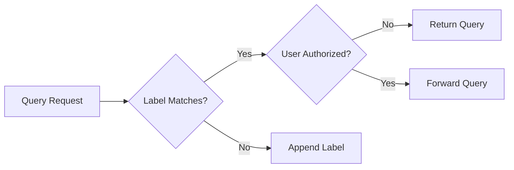

# Multena Proxy
---
> Making the LGTM-Stack MULti TENAncy ready

**Multena Proxy** is a multi-tenancy ready tool designed to enhance the authorization capabilities of your LGTM (Loki
Grafana Tempo Mimir/Prometheus) stack. Built with LBAC (Label Based Access Control) at its core, Multena provides secure
and granular user authorization based on assigned tenant labels. It integrates seamlessly with Thanos and Loki, and
supports Keycloak for identity management. With features like ConfigMap-based configuration, flexible authorization
providers, and multiple tenant labels, Multena ensures that the right data is accessible to the right users.

---

## How does it work?



In summary, here's how Multena works:

1. Query Request: Multena receives a query request from a user.
2. Label Matching: Multena examines the query and looks for label matches based on the specified tenant label.
3. Label Appending: If the query does not contain the specified label match, Multena appends the label to the query.
4. Authorization Check: If the query contains the specified label match, Multena checks if the user is allowed to query
   the value of the label match.
5. Query Return: If the user is not authorized to query the value of the label match, Multena returns the query and
   prevents further processing.
6. Forwarding Query: If the user is authorized to query the value of the label match, Multena forwards the query to the
   specific endpoint or service responsible for processing it.

By performing label matching, appending labels when necessary, and performing authorization checks, Multena ensures that
users can only query data they are authorized to access.

## Multena Features

| **Feature**                      | **Description**                                                                                                                                                                                                             |
|----------------------------------|-----------------------------------------------------------------------------------------------------------------------------------------------------------------------------------------------------------------------------|
| Authorization Based on Labels    | Enables access control and permissions based on specified labels, ensuring fine-grained access control tailored to your needs.                                                                                              |
| Configurable via ConfigMap       | Allows easy configuration of the proxy using a ConfigMap, simplifying setup process and management of configuration settings.                                                                                               |
| Flexible Authorization Providers | Supports both ConfigMap and database authorization providers. Choose the provider that best fits your requirements.                                                                                                         |
| Integration with Thanos and Loki | Seamlessly integrates with Thanos and Loki for efficient authorization. Manage and control access to these powerful observability tools.                                                                                    |
| Support for Keycloak and Jwks    | Provides support for Keycloak, a popular open-source identity and access management solution. Authenticate users using Keycloak and retrieve the JWKS (JSON Web Key Set) certificate for secure and reliable authorization. |
| Admin Group Privileges           | Includes an admin group feature allowing users in the specified admin group to bypass authorization checks. This is useful for granting administrative privileges to specific users.                                        |
| Multiple Tenant Labels           | Supports multiple tenant labels for managing different sets of labels for different tenants. Customize and control access for various groups and users based on their respective tenant labels.                             |

These powerful features enhance Multena's authorization capabilities, offering granular control over access permissions
and facilitating seamless integration with Thanos, Loki, and identity providers like Keycloak.

## Currently queryable

- [x] Metrics
- [x] Logging
- [ ] Traces
- [ ] Profiles

## Request flow


## Deploy Multena

The helm chart for Multena is available
at [gp-helm-charts](https://github.com/gepaplexx/gp-helm-chart-development/tree/develop/infra/gp-multena)

To install it run the following commands:

```bash 
helm repo add gepardec https://gepaplexx.github.io/gp-helm-charts/
helm install multena gepardec/gp-multena -n <grafana-namespace>
```

To upgrade it run the following commands:

```bash
helm repo update
helm upgrade multena gepardec/gp-multena -n <grafana-namespace>
```

> **_NOTE:_** The helm chart has a option to install grafana-operator-datasources which simplifies the deployment of
> Multena. If you deploy Multena without the grafana-operator-datasources you have to configure the datasource manually.

# Configuring Multena

## Modes

> **_NOTE:_** Multena utilizes two different providers for label lookup, namely ConfigMap and MySQL.

> With the ConfigMap provider, Multena can retrieve labels by reading a separate ConfigMap that defines a list of
> allowed labels for each user or group. This approach allows for easy configuration and management of label permissions
> by specifying the allowed labels directly in the ConfigMap. An exaple can be found
> here [labels.yaml](./configs/labels.yaml)

> On the other hand, Multena also supports the MySQL provider, which enables label lookup through executing a custom
> query against a MySQL database. This powerful capability allows Multena to dynamically fetch the allowed namespaces
> for a specified email or user. By setting the appropriate query in the configuration, Multena can seamlessly retrieve
> the relevant label information from the MySQL database.

## Configuration

### config.yaml

#### proxy section

```yaml
proxy:
  log_level: INFO
  provider: configmap # this depends if you want to use a configmap or database
  thanos_url: https://thanos.url:3000
  loki_url: https://loki.url:3000
  jwks_cert_url: https://sso.example.com/realms/internal/protocol/openid-connect/certs
  admin_group: gepardec-run-admins
  port: 8080
  tenant_labels:
    thanos: namespace
    loki: kubernetes_namespace_name
```

| Explanation                                               | Configuration              | Value                                                                 |
|-----------------------------------------------------------|----------------------------|-----------------------------------------------------------------------|
| log level for the proxy                                   | proxy.log_level            | INFO                                                                  |
| Determines whether to use a configmap or mysql for labels | proxy.provider             | configmap                                                             |
| URL for Thanos                                            | proxy.thanos_url           | https://thanos.url:3000                                               |
| URL for Loki                                              | proxy.loki_url             | https://loki.url:3000                                                 |
| URL for the JWKS certificate                              | proxy.jwks_cert_url        | https://sso.example.com/realms/internal/protocol/openid-connect/certs |
| Admin group for the proxy which skips authorization       | proxy.admin_group          | gepardec-run-admins                                                   |
| Port on which the proxy will listen                       | proxy.port                 | 8080                                                                  |
| Tenant label for Thanos to be enforced                    | proxy.tenant_labels.thanos | namespace                                                             |
| Tenant label for Loki to be enforced                      | proxy.tenant_labels.loki   | kubernetes_namespace_name                                             |

#### db section

```yaml
db:
  user: multitenant
  password_path: "."
  host: localhost
  port: 3306
  dbName: example
  query: "SELECT * FROM users WHERE username = ?"
```

| Configuration    | Value                                    | Explanation                              |
|------------------|------------------------------------------|------------------------------------------|
| db.user          | multitenant                              | username for the database                |
| db.password_path | "."                                      | path to the password for the database    |
| db.host          | localhost                                | host of the database                     |
| db.port          | 3306                                     | port of the database                     |
| db.dbName        | example                                  | name of the database                     |
| db.query         | "SELECT * FROM users WHERE username = ?" | query to retrieve data from the database |

The table above provides a breakdown of each configuration option, its corresponding value, and a brief explanation of
its purpose. You can customize these values according to your specific requirements when configuring the database for
Multena.

### labels.yaml

The `labels.yaml` file is used to define the allowed labels for groups and users in Multena. It follows a specific YAML
format as shown below:

```yaml
groups:
  - example_group: [ "example_namespace", "another_example_namespace" ]
users:
  - example_user: [ "example_namespace", "different_example_namespace" ]
```

In the `labels.yaml` file, you define the groups and users along with the corresponding allowed namespaces.
In this example, the `example_group` is allowed to access the `example_namespace` and `another_example_namespace`.
Similarly, the `example_user` is also allowed to access the `example_namespace` and `different_example_namespace`.

Feel free to customize the group-names, usernames, and tenant label values according to your specific requirements. This
file allows you to manage label permissions effectively within Multena, ensuring appropriate access control for groups
and users.

## To configure the Proxy Multena, follow these steps:

1. Create a YAML file (e.g., `config.yaml`).

2. Copy the sample configuration provided above into the file.

3. Modify the configuration options according to your requirements. Here's an overview of the options you might need to
   modify:

    - For `provider` set either configmap or mysql depending on your needs.

    - Set the appropriate values for `log_level`, `thanos_url`, `loki_url`, `jwks_cert_url`, `admin_group`, and `port`
      based on your environment and preferences.

    - Adjust the values of `tenant_labels.thanos` and `tenant_labels.loki` to match your desired tenant labels.

    - If you don't need the development mode, set `dev.enabled` to `false`. Otherwise, set `dev.username`
      and `dev.service_account_token` to appropriate values.

    - 3.1 Database: If you use mysql as a provider update the `db` section with the correct values
      for `user`, `password_path`, `host`, `port`, `dbName`, and `query` to connect to your database and execute the
      desired query.

    - 3.2 ConfigMap: If you have set the current provider to ConfigMap, you need to configure the labels by using a
      labels.yaml file with the following format:
      ```yaml
      groups:
         - example_group: [ "example_namespace" ]
      users:
         - example_user: [ "example_namespace" ]
      ````
      In the labels.yaml file, you define the allowed labels for groups and users. Each group or user is listed along
      with
      the corresponding list of allowed namespaces. For example, the example_group is allowed to access the
      example_namespace, and the example_user is also allowed to access the example_namespace.

4. Add Multena as Grafana data source and configure it with the correct values:
   The Datasource needs two headers to be set:
    - `Accept-Encoding:"*/*"`
    - `X-Plugin-Id: <thanos or loki>`
      to work properly it also needs the forward oauth identify option to be set.
      The loki option may need the "/api/logs/v1/application/" url suffix to work properly

By following these steps and customizing the configuration options to your needs, you can effectively configure
Multena to work with your Grafana, Thanos, Loki, and database setup.